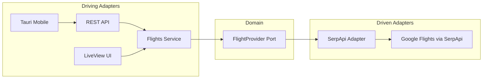

# Flight Tracker - Architecture Documentation

> **Monorepo** with Phoenix web backend and Tauri mobile app for flight tracking.

---

## Project Structure

```
apps/
├── web/                    # Phoenix (Elixir) - Backend + Web UI
│   ├── lib/
│   │   ├── airflights/         # Domain Layer
│   │   │   ├── flights.ex          # 🎯 Application Service (entry point)
│   │   │   ├── flights/offer.ex    # Domain Entity
│   │   │   ├── ports/              # 📋 Contracts (behaviours)
│   │   │   │   └── flight_provider.ex
│   │   │   └── adapters/           # 🔌 Implementations
│   │   │       ├── serpapi/        # SerpApi (Google Flights)
│   │   │       └── resilient_provider.ex
│   │   └── airflights_web/     # Web Layer
│   │       ├── controllers/api/    # REST API
│   │       ├── live/               # LiveView UI
│   │       └── components/         # Reusable components
│   └── assets/                 # Frontend (Tailwind, Vue via LiveVue)
│
└── mobile/                 # Tauri (Rust + Vue) - Cross-platform app
    ├── src/                    # Vue 3 frontend
    │   ├── components/         # UI components
    │   ├── api.ts              # API client
    │   └── locales/            # i18n (en/es)
    └── src-tauri/              # Rust backend
        └── gen/                # iOS/Android targets
```

---

## Architecture Pattern

### Hexagonal (Ports & Adapters)



| Layer | Location | Responsibility |
|-------|----------|----------------|
| **Ports** | `lib/airflights/ports/` | Behaviours defining contracts |
| **Adapters** | `lib/airflights/adapters/` | Concrete implementations |
| **Services** | `lib/airflights/flights.ex` | Business logic orchestration |
| **Controllers** | `lib/airflights_web/controllers/` | HTTP interface |

---

## REST API

### Endpoints

| Method | Path | Description |
|--------|------|-------------|
| `POST` | `/api/flights/cheapest` | Get cheapest flight |
| `POST` | `/api/flights/search` | Search all flights |
| `GET` | `/api/flights/defaults` | Get top 5 suggested flights |

### Example Request

```bash
curl -X POST http://localhost:4000/api/flights/search \
  -H "Content-Type: application/json" \
  -d '{"origin": "MEX", "destination": "VIE", "date": "2025-02-15"}'
```

### Response

```json
{
  "success": true,
  "data": [
    {
      "price": 8500.00,
      "currency": "MXN",
      "departure_at": "2025-02-15 08:00",
      "duration": "PT15H30M",
      "stops": 1,
      "airline": "Air France",
      "airline_code": "AF",
      "segments": [...]
    }
  ]
}
```

---

## Tech Stack

| Component | Technology | Version |
|-----------|------------|---------|
| **Backend** | Phoenix | 1.8 |
| **Language** | Elixir | 1.15+ |
| **Web UI** | LiveView + Components | - |
| **Web Styling** | Tailwind CSS | 3.x |
| **Mobile Framework** | Tauri | 2.0 |
| **Mobile UI** | Vue 3 + TypeScript | 3.5 |
| **Mobile Styling** | Tailwind CSS | 4.x |
| **Flight Data** | SerpApi (Google Flights) | - |

---

## Configuration

### Environment Variables

```bash
# SerpApi (required for flight search)
SERPAPI_API_KEY=your_api_key

# Get your free API key at https://serpapi.com
```

### Dependency Injection

The flight provider is configured in `config/config.exs`:

```elixir
config :airflights,
  flight_provider: Airflights.Adapters.ResilientProvider
```

---

## Running the Project

### Web App (Phoenix)

```bash
cd apps/web
export SERPAPI_API_KEY="your_key"
mix deps.get
cd assets && npm install && cd ..
mix phx.server
```
→ Open http://localhost:4000

### Mobile App (Tauri)

```bash
cd apps/mobile
npm install
npm run tauri dev          # Desktop
npm run tauri ios dev      # iOS Simulator
npm run tauri android dev  # Android Emulator
```

> **Note**: Mobile app requires the Phoenix backend running on port 4000.

---

## Security

- API keys are **never** exposed to the frontend
- All sensitive config is loaded from environment variables at runtime
- The `.gitignore` excludes `.env` files
- Mobile app communicates only with the backend, never directly with SerpApi

---

## Recent Changes

- **SerpApi Integration**: Replaced Amadeus with SerpApi (Google Flights)
- **Expanded Search Form**: Origin/destination selection, round-trip support
- **Multi-result Display**: Shows top 5 cheapest flights
- **Internationalization**: English and Spanish support
- **Mobile Sync**: Full feature parity between web and mobile

---

## Coding Guidelines

See [AGENTS.md](./apps/web/AGENTS.md) for:
- Elixir best practices
- Phoenix LiveView patterns
- Ecto guidelines
- HEEx template rules
