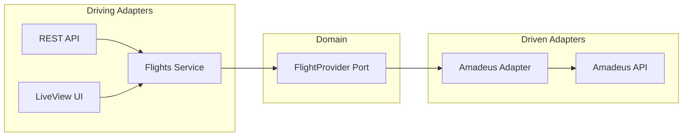

# Flight Tracker - Architecture Documentation

> **Monorepo** with Phoenix web backend and Tauri mobile app for flight tracking.

---

## Project Structure

```
apps/
├── web/                    # Phoenix (Elixir) - Backend + Web UI
│   ├── lib/
│   │   ├── airflights/         # Domain Layer
│   │   │   ├── flights.ex          # 🎯 Application Service (entry point)
│   │   │   ├── flights/offer.ex    # Domain Entity
│   │   │   ├── ports/              # 📋 Contracts (behaviours)
│   │   │   │   ├── flight_provider.ex
│   │   │   │   └── auth_provider.ex
│   │   │   └── adapters/           # 🔌 Implementations
│   │   │       └── amadeus/        # Amadeus API client
│   │   └── airflights_web/     # Web Layer
│   │       ├── controllers/api/    # REST API
│   │       └── live/               # LiveView UI
│   └── assets/                 # Frontend (Tailwind, Vue via LiveVue)
│
└── mobile/                 # Tauri (Rust + Vue) - Cross-platform app
    ├── src/                    # Vue 3 frontend
    │   ├── components/         # UI components
    │   ├── api.ts              # API client
    │   └── index.css           # Tailwind v4 styles
    └── src-tauri/              # Rust backend
        └── gen/                # iOS/Android targets
```

---

## Architecture Pattern

### Hexagonal (Ports & Adapters)



| Layer | Location | Responsibility |
|-------|----------|----------------|
| **Ports** | `lib/airflights/ports/` | Behaviours defining contracts |
| **Adapters** | `lib/airflights/adapters/` | Concrete implementations |
| **Services** | `lib/airflights/flights.ex` | Business logic orchestration |
| **Controllers** | `lib/airflights_web/controllers/` | HTTP interface |

---

## REST API

### Endpoints

| Method | Path | Description |
|--------|------|-------------|
| `POST` | `/api/flights/cheapest` | Get cheapest flight |
| `POST` | `/api/flights/search` | Search all flights |

### Example Request

```json
POST /api/flights/cheapest
{
  "origin": "MEX",
  "destination": "VIE", 
  "date": "2025-02-15"
}
```

### Response

```json
{
  "success": true,
  "data": {
    "price": 850.50,
    "currency": "USD",
    "departure_at": "2025-02-15T08:00:00Z",
    "duration": "PT15H30M",
    "stops": 1,
    "airline_code": "LH"
  }
}
```

---

## Tech Stack

| Component | Technology | Version |
|-----------|------------|---------|
| **Backend** | Phoenix | 1.8 |
| **Language** | Elixir | 1.15+ |
| **Database** | PostgreSQL | - |
| **Web Styling** | Tailwind CSS | 3.x |
| **Mobile Framework** | Tauri | 2.0 |
| **Mobile UI** | Vue 3 + TypeScript | 3.5 |
| **Mobile Styling** | Tailwind CSS | 4.x |
| **External API** | Amadeus | v1 |

---

## Configuration

### Environment Variables

```bash
# Amadeus API (required for flight search)
AMADEUS_API_KEY=your_api_key
AMADEUS_API_SECRET=your_api_secret

# Optional: Change flight provider
# config :airflights, :flight_provider, MyApp.MockProvider
```

### Dependency Injection

The flight provider is configured in `config/config.exs`:

```elixir
config :airflights, :flight_provider, Airflights.Adapters.Amadeus.FlightProvider
```

---

## Running the Project

### Web App (Phoenix)

```bash
cd apps/web
mix deps.get
cd assets && npm install && cd ..
mix phx.server
```
→ Open http://localhost:4000

### Mobile App (Tauri)

```bash
cd apps/mobile
npm install
npm run tauri dev          # Desktop
npm run tauri ios dev      # iOS Simulator
npm run tauri android dev  # Android Emulator
```

---

## Recent Changes

### Tailwind CSS v4 Migration (Mobile)

Migrated `apps/mobile` from vanilla CSS to Tailwind CSS v4:

- **Plugin**: `@tailwindcss/vite` (not PostCSS)
- **Config**: CSS-first with `@theme` directive
- **Result**: ~51% code reduction across components

See: [walkthrough.md](file:///Users/ivanalvarezfrias/.gemini/antigravity/brain/29061168-6e74-4a50-a618-dce61d94e84c/walkthrough.md)

---

## Coding Guidelines

See [AGENTS.md](file:///Users/ivanalvarezfrias/projects/18-airflights-ai/apps/web/AGENTS.md) for:
- Elixir best practices
- Phoenix LiveView patterns
- Ecto guidelines
- HEEx template rules
