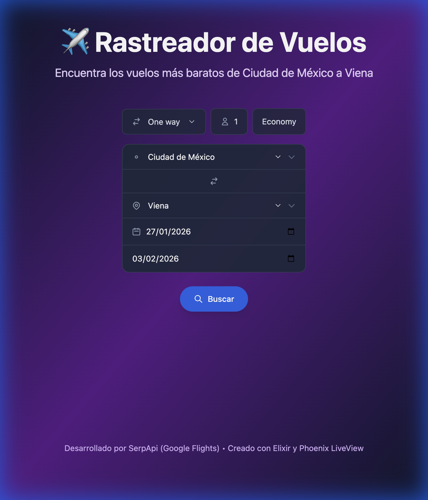
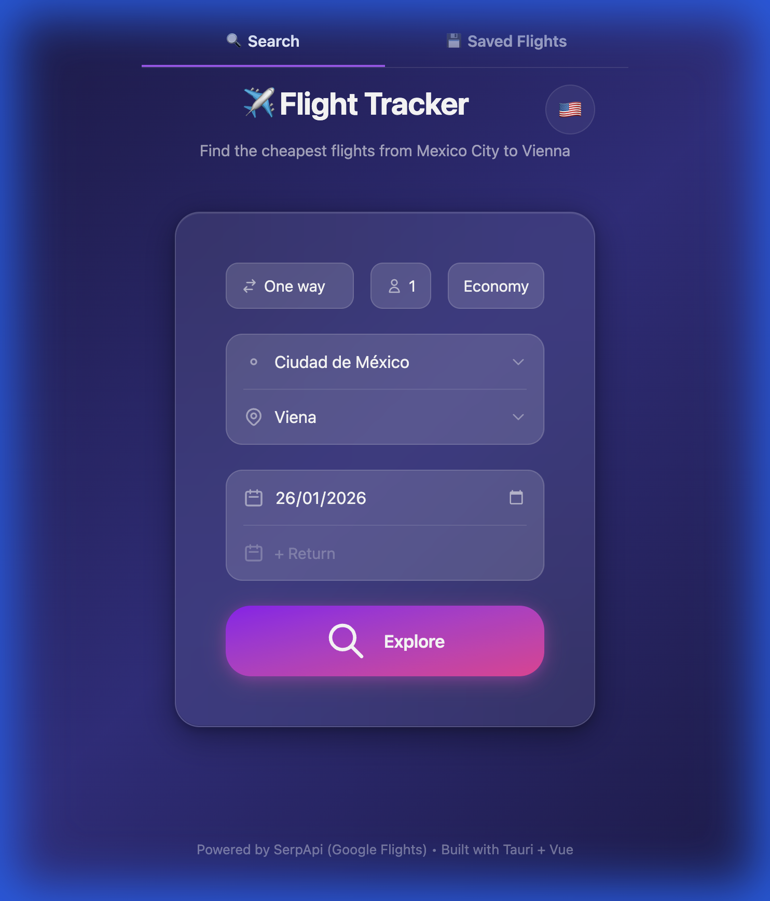

# ✈️ Flight Tracker

A monorepo flight search application with Phoenix LiveView web app and Tauri mobile app.

## 🌟 Features

- **Real-time flight search** powered by SerpApi (Google Flights)
- **Multi-platform**: Web + Desktop + iOS + Android
- **Internationalization**: English and Spanish
- **Offline support**: Save flights for offline viewing (mobile)
- **Top 5 results**: Compare the cheapest flight options

## 📁 Project Structure

```
apps/
├── web/      # Phoenix + LiveView (Elixir backend)
└── mobile/   # Tauri + Vue 3 (Desktop/iOS/Android)
```

## 🚀 Quick Start

### Prerequisites

- Elixir 1.15+
- Node.js 18+
- [SerpApi API Key](https://serpapi.com/) (free tier available)

### Web App (Phoenix)

```bash
cd apps/web
export SERPAPI_API_KEY="your_api_key_here"
mix deps.get
cd assets && npm install && cd ..
mix phx.server
```
→ Open http://localhost:4000

### Mobile/Desktop App (Tauri)

```bash
cd apps/mobile
npm install
npm run tauri dev          # Desktop
npm run tauri ios dev      # iOS Simulator
npm run tauri android dev  # Android Emulator
```

> **Note**: The mobile app requires the Phoenix backend to be running.

## 🏗️ Architecture

- **Hexagonal Architecture** with ports/adapters pattern
- **REST API** at `/api/flights/*` for mobile consumption
- **SerpApi** integration (Google Flights data)
- **Dependency Injection** for testable, swappable components

See [ARCHITECTURE.md](./ARCHITECTURE.md) for detailed documentation.

## 📡 API Endpoints

| Method | Path | Description |
|--------|------|-------------|
| `POST` | `/api/flights/cheapest` | Get cheapest flight |
| `POST` | `/api/flights/search` | Search all flights |
| `GET` | `/api/flights/defaults` | Get suggested flights |

## 🛠️ Tech Stack

| Layer | Technology |
|-------|------------|
| Backend | Phoenix 1.8 + LiveView |
| Mobile | Tauri 2.0 + Vue 3 |
| Languages | Elixir, TypeScript, Rust |
| Styling | Tailwind CSS |
| Flight Data | SerpApi (Google Flights) |

## ⚙️ Environment Variables

```bash
# Required for flight search
SERPAPI_API_KEY=your_serpapi_key
```

> Get your free API key at [serpapi.com](https://serpapi.com/)

## 📸 Screenshots

| Web | Mobile |
|-----|--------|
|  |  |

## 📄 License

MIT
