# Price Watcher - Arquitectura Híbrida

> Sistema de alertas de precios con Elixir (servidor) + Rust (cliente)

---

## Arquitectura General

```mermaid
graph TB
    subgraph "📱 TAURI APP (iOS/Android/Desktop)"
        Vue[Vue UI]
        Rust[Rust Backend]
        SQLite[(SQLite Local)]
    end
    
    subgraph "☁️ SERVIDOR"
        Phoenix[Phoenix API]
        GenServer[GenServer Monitor]
        Postgres[(PostgreSQL)]
        SerpApi[SerpApi Adapter]
    end
    
    subgraph "🌐 EXTERNO"
        Google[Google Flights]
    end
    
    Vue -->|invoke| Rust
    Rust -->|HTTP| Phoenix
    Rust --> SQLite
    
    Phoenix --> GenServer
    GenServer --> Postgres
    GenServer --> SerpApi
    SerpApi --> Google
```



---

## Flujo 1: Crear Watcher

```mermaid
sequenceDiagram
    actor User as 👤 Usuario
    participant Vue as 📱 Vue
    participant Rust as 🦀 Rust
    participant Phoenix as 🔮 Phoenix
    participant DB as 🗄️ PostgreSQL
    participant GS as ⚙️ GenServer

    User->>Vue: Configura alerta
    Vue->>Rust: invoke('create_watcher')
    Rust->>Phoenix: POST /api/watchers
    Phoenix->>DB: INSERT watcher
    Phoenix->>GS: Inicia monitor
    GS-->>Phoenix: OK
    Phoenix-->>Rust: {id, status: "active"}
    Rust-->>Vue: Watcher creado
    Vue-->>User: ✅ "Monitoreando"
```



---

## Flujo 2: Monitoreo en Background

```mermaid
sequenceDiagram
    participant GS as ⚙️ GenServer
    participant SerpApi as 🔍 SerpApi
    participant DB as 🗄️ PostgreSQL

    loop Cada hora
        GS->>GS: Process.sleep(3600)
        GS->>SerpApi: Buscar precio
        SerpApi-->>GS: $8,500
        
        alt Precio < Objetivo
            GS->>DB: INSERT alert
            Note over DB: Alerta guardada
        else Precio >= Objetivo
            GS->>DB: UPDATE last_price
        end
    end
```



---

## Flujo 3: Usuario Abre la App

```mermaid
sequenceDiagram
    actor User as 👤 Usuario
    participant Vue as 📱 Vue
    participant Rust as 🦀 Rust
    participant Phoenix as 🔮 Phoenix
    participant Notif as 🔔 Notificación

    User->>Vue: Abre app
    Vue->>Rust: invoke('check_alerts')
    Rust->>Phoenix: GET /api/alerts
    Phoenix-->>Rust: [{route, price, time}]
    
    alt Hay alertas nuevas
        Rust->>Notif: Notificación local
        Notif-->>User: 🔔 "¡MEX→VIE bajó!"
    end
    
    Rust-->>Vue: Lista de alertas
    Vue-->>User: Muestra UI
```



---

## Modelo de Datos

### PostgreSQL (Servidor)


### SQLite (App Local)

```sql
-- Cache local de alertas
CREATE TABLE local_alerts (
    id TEXT PRIMARY KEY,
    watcher_id TEXT,
    route TEXT,
    old_price REAL,
    new_price REAL,
    triggered_at TEXT,
    is_read INTEGER DEFAULT 0
);
```

---

## Stack Tecnológico

| Capa | Tecnología | Rol |
|------|------------|-----|
| **UI** | Vue 3 | Interfaz de usuario |
| **Cliente** | Rust + Tauri | HTTP, SQLite, Notificaciones |
| **API** | Phoenix | REST endpoints |
| **Monitor** | GenServer | Background job 24/7 |
| **DB Servidor** | PostgreSQL | Watchers, alerts |
| **DB Local** | SQLite | Cache offline |
| **Vuelos** | SerpApi | Google Flights data |

---

## ¿Por qué esta arquitectura?

| Requisito | Solución |
|-----------|----------|
| Monitoreo 24/7 | GenServer en servidor |
| Funciona sin cuenta Apple | No requiere APNs |
| Muestra Rust | HTTP client + SQLite desde Rust |
| Muestra Elixir | GenServer, OTP, supervisión |
| Funciona en iOS | Notificaciones locales al abrir |
